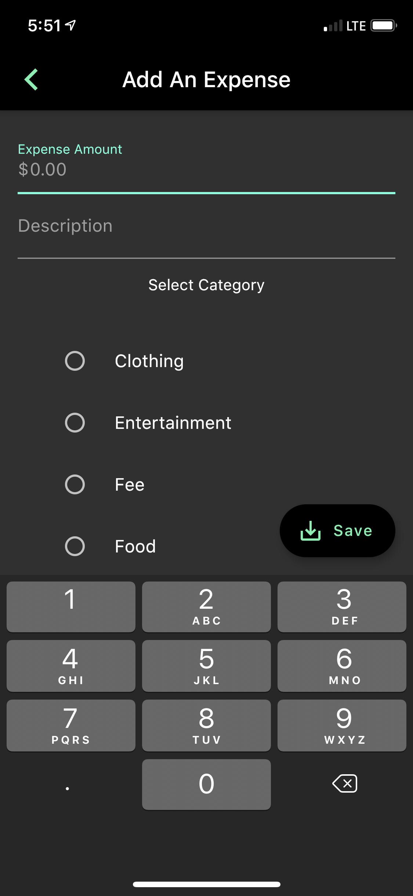
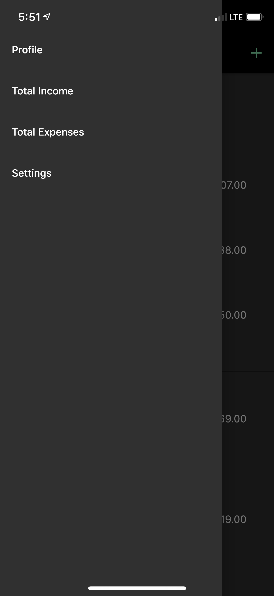

# MoMoney
Software Engineering Project (Mobile Application)
COMP 380/L

Developers:
Alan Constatino,
Stephanie Walker,
Brandon Dupitas

## Table of Contents
- [Test your environment](#test-your-environment)

- [Learning Resources](#learning-resources)

- [Final Product Screenshots](#final-product-screenshots)


## Test your environment
1. Clone this repository ```git clone https://github.com/AlanConstantino/MoMoney.git```
2. Open the file ```main.dart``` from the repository you just cloned under the directory ```momoney/lib/main.dart``` with your favorite text editor.
   - [Click here if you have not yet set up your preferred editor](https://flutter.dev/docs/get-started/editor?tab=vscode).
3. Run the Flutter project with your specific editor or from the terminal.
   - This step is editor-specific unless you're using the terminal.
     - [Click here](https://flutter.dev/docs/get-started/test-drive?tab=vscode) for more specific details on how run the
       application with your specific editor.
4. If everything went correctly you should see something like [this](https://imgur.com/qAvDeuB).

## Learning Resources
- [Effective Dart: Style](https://dart.dev/guides/language/effective-dart/style)
- [Intro to Dart for Java Developers](https://codelabs.developers.google.com/codelabs/from-java-to-dart/#0)
- [Video playlist for the Dart programming language](https://www.youtube.com/watch?v=5rtujDjt50I&list=PLlxmoA0rQ-LyHW9voBdNo4gEEIh0SjG-q)
- [Flutter documentation](https://flutter.dev/docs)
- [Video playlist for a crash course on Flutter](https://fluttercrashcourse.com/lessons/materialapp-scaffold-appbar-text)

## Final Product Screenshots






